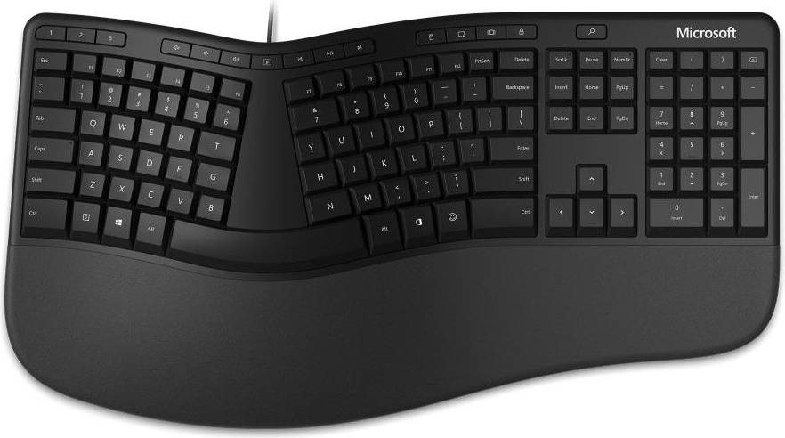
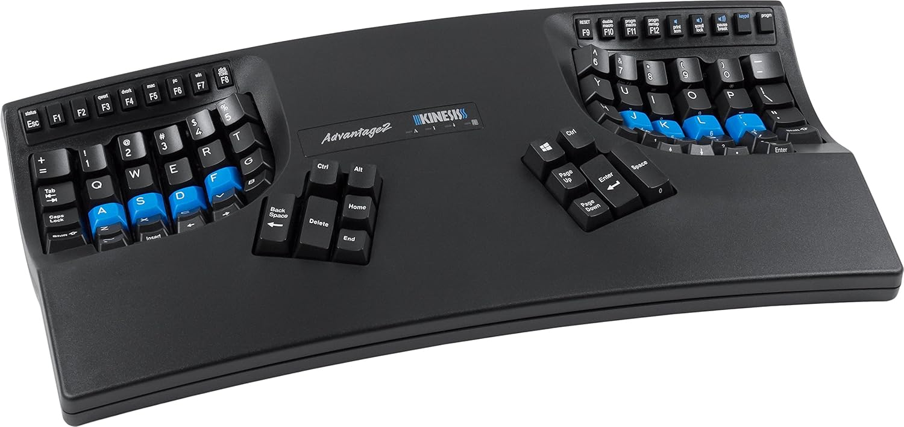
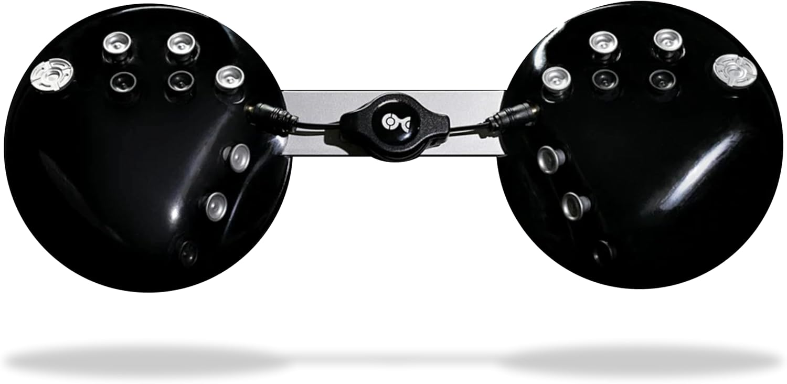
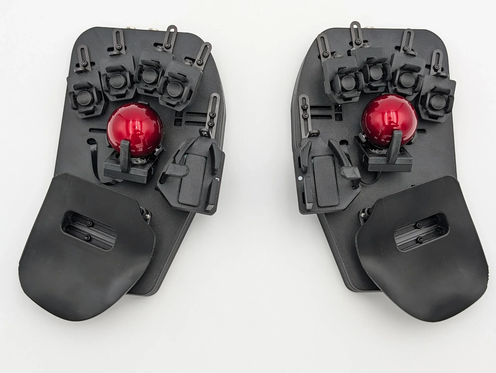
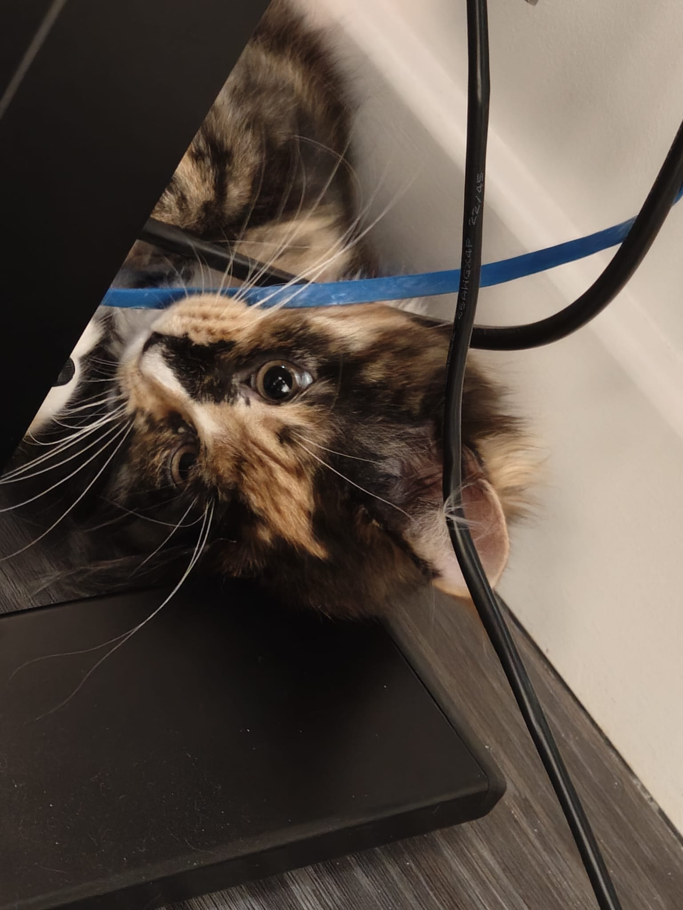
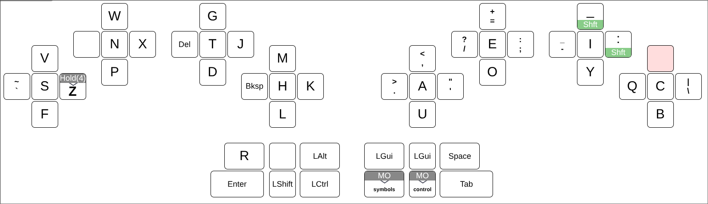
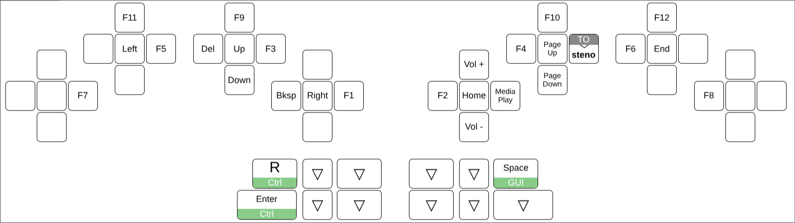
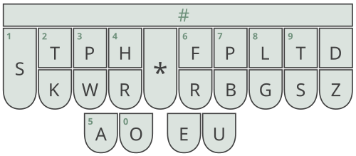

:experimental:
:qwerty: pass:[<abbr>QWERTY</abbr>]

== My background

Even before I started pressing buttons for a living I was always a
pretty heavy computer user.  When I was about 18 I started
experiencing symptoms of RSI.  At around the same time I learnt of the
Dvorak keyboard layout, and so I switched, hoping it would solve my
problems.  It did, at least at the time, and so for the last 17 years
I've been a Dvorak user.

At the same time I'm really interested in human/machine interaction
and ways to get the contents of the human brain into a machine as
fluently as possible.  As a combined result of these two factors, I
worked my way through a few different physical keyboards, including
the Microsoft Ergonomic series (which I struggled to make Windows 2000
recognize — go figure) and a Kinesis Advantage, but my keyboard of
choice for many years now has been the
link:https://ergodox-ez.com/[Ergodox EZ].  The Ergodox (and its ZSA
comrade the Moonlander) is a solid keyboard, with a few features that
I've come to realize are very important:

*Split halves*. Any keyboard with the halves joined together (that is
narrower than shoulder-width, as is the case with every joined
keyboard I've seen so far) causes the elbows to bend in and the wrists
to bend out, which seems to be the primary trigger of wrist pain
for me.

*Tenting*. Ditto for the elbows: last year I found myself struggling
with pain and numbness in my arm that, on investigation, matched
symptoms of early cubital tunnel syndrome.  Tenting, rotating the
halves of the keyboard so that the wrists sit in a slight angle,
allows the elbows to rest in a more natural slightly-bent position,
and since adopting it I haven't had any further problems with my elbow.

.The Microsoft Ergonomic Keyboard.
[link=https://www.pricerunner.com/pl/111-3200273096/]

*Thumb clusters*. The first symptom I got was what's affectionately
known as ‘emacs pinky’. footnote:[In fact, on most keyboards (though
sadly no longer on ThinkPads) the control key, positioned in the
bottom-right corner, can and should be held with the palm — this makes
some combinations more awkward, though no more awkward than with the
little finger, and saves the weakest digit.  In fact, I think it would
be better named for vi — the escape key is perhaps the least ergonomic
key on a standard keyboard.  Some people like to put it in the place
of caps-lock, which is of course entirely missing the point.] The
reason I picked up the Kinesis Advantage is that on these keyboards
the thumb, which is highly underutilized in standard layouts, gets a
dedicated cluster of keys, perfect for things like modifiers, since
the opposable thumbs don't limit the motion of the rest of the hand at
all, no matter how it's engaged.

.The Kinesis Advantage.  This one is wireless, while mine, the original model, was connected by PS/2 cable.  But the layout hasn't changed.
[link=https://kinesis-ergo.com/shop/advantage2/]

*Programmability*. My customization is light compared to some
people's, but my keyboard usage is pretty idiosyncratic, so it's
important to me to be able to customize my keyboard when I need to.
Particularly for keyboards with fewer keys that need heavier layer
usage, I want to be able to set up the layers as I want.  My most
elaborate customization is that I am (from time to time) a hobbyist
link:https://en.wikipedia.org/wiki/Stenotype[stenographer], and rather
than having a separate device I find it convenient to be able to
configure my keyboard to speak one of the steno protocols understood
by link:https://www.openstenoproject.org/plover/[Plover] such as TX
Bolt or GeminiPR.

== Finger-oriented keyboarding

With this in mind, I was pretty excited when I stumbled across the
link:https://www.charachorder.com/[CharaChorder].  The promise is
simple: increase typing speed through a combination of minimizing
finger movement and stenography-style chording (albeit with a theory
designed to have a shallower learning curve, basically just mashing
all the letters of the word at once).  I signed up to the
pre-order, and when I got it I immediately started playing around,
practising a few hours per day on the (very good!) training software.

.The CharaChorder One.
[link=https://www.charachorder.com/]

If you've ever done typing training, you'll know that most of the
point of the drills and forms that they teach you is to keep your
fingers on the home row so that you can reach all the letters with a
minimum of movement.  The CharaChorder turns this on its head: on the
CharaChorder there is _only_ the home row.  Where you would stretch up
or down or sideways to reach a key on a traditional keyboard, on the
CharaChorder you simply wiggle a joystick in that direction, never
taking your finger off the key. footnote:[There is in fact a second
row of joysticks used for arrow keys or mouse emulation, but we'll
ignore them for the purposes of this since they don't impact most of
the typing experience.]

I loved the compact form factor combined with the power of chording,
and I was excited to develop a new steno theory based on the
CharaChorder's unique structure.  Unfortunately, I was thwarted: the
CC1 runs the CharaChorder OS, a closed-source project with only a
restricted set of chording configurations, and the fact that it must
take place on-device severely limits what can be done compared to the
software-based solutions I was used to.  The CC1 is great for people
who need to travel and connect their device to many different
computers, but that's not my use-case.  Furthermore ergonomics are
decidedly not a priority for the CharaChorder, with (for example) the
down presses being a chord of each of the cardinal directions, for a
hefty (42 × 4 = 168) grams of force to activate, and some default
chords requiring punishing scissoring and twisting motions that left
my hands very sore after a practice session.  The final straw for me
was that a month or so into using the CC1 one of my joysticks broke,
coming loose in its housing; CC were kind enough to send me a
replacement half, but shortly after that arrived the same thing
happened to a joystick on the remaining half from the first keyboard!
footnote:[I hear that the build quality has improved significantly on
the CC2; please don't be put off from trying it by this experience of
mine!  It remains a really nifty device, especially if you regularly
need to transport your keyboard and use it with computers whose
software you don't control, or if you want to
link:https://www.charachorder.com/en-gb/products/wear-a-chorder[attach
the keyboard to your trousers].]

Thankfully, on the CharaChorder Discord I was introduced to the
link:https://svalboard.com/[Svalboard Lightly].

== The Svalboard Lightly

The Svalboard, a descendent of the beloved
link:https://en.wikipedia.org/wiki/DataHand[DataHand], is based on the
same principles as the CharaChorder: each finger gets a key ‘cluster’
and rather than moving the finger off the key to reach other keys as
in traditional keyboards, the finger stays in its cluster and merely
moves in a direction to press a key — including down, like a standard
keyboard but mostly unlike the CharaChorder, in which the down press
is too awkward to use as part of standard typing.

.The Svalboard Lightly.
[link=https://svalboard.com/products/lightly]

It throws away the usual mechanical keyboard spring-loaded switches in
favour of something at once simpler and more high-tech: an infrared
source fires a beam at the stem of the key, initially blocked by a
‘flag’ on the keystem, and triggers a keypress when the key is moved
out of the way to allow the beam to hit a detector.  Magnets — actual,
permanent bits of magnetic neodymium — are used to replace the
tactility of traditional switch springs, with pressing the key
requiring breaking the magnets' hold in a rather satisfying way that
feels similar to a traditional buckling spring but requires much less
total force to activate.

This is in line with its philosophy: apart from the circuitry and the
magnets, everything is 3D-printed to open schematics and held together
with standard screws, ensuring that any piece that's likely to break
can be replaced, even if the board stops being produced (as happened
to the DataHand).

=== The excellent

The Svalboard runs link:https://qmk.fm/[QMK], a de-facto standard for
customizable keyboard firmware that I was already used to from the
Ergodox.  Something that was new to me, though, footnote:[ZSA do now
provide link:https://www.zsa.io/oryx[Oryx], configuration software
with a similar purpose; I'd just never tried it!] was that the variant
of QMK it uses (by default) is a custom spin of
link:https://get.vial.today/[Vial], a fork of QMK enriched with
dynamic layout editing via a GUI editor, or (for the Svalboard) the
excellent link:https://captdeaf.github.io/keybard/[Keybard], which
replaces the Vial frontend with a much lighter-weight Web-based
alternative.

I'd never bothered to get set up with a graphical configurator before,
reasoning that I'm perfectly capable of writing a bit of C so I might
as well avail myself of the full power of the firmware, but the
qualitative difference it made, especially as I was still getting used
to the board and ‘dialled in’ to make my everyday tasks comfortable,
was phenomenal.  The ability to open a Web page and tweak a key has
led to a huge number of quality-of-life improvements that I could have
made without it but never did because I didn't want to interrupt my
workflow to flash my keyboard, and then I promptly forgot about them.

That ties neatly into another aspect of the Svalboard I really
appreciate: every part is minutely customizable.  At build time
several options are available for different key sizes and shapes, and
at the time of writing there are three different pointing devices
available which can be swapped out on either side of the Svalboard.
But even after assembly every part of the board that the user's hand
touches can be shifted, rotated, raised, lowered, or detached entirely
by loosening some screws.  For the first few months I kept a
screwdriver on my desk so I could make small adjustments as I noticed
certain movements were more or less comfortable for me, and the
software allows me to easily tweak my layout to put more common
actions on more easily-reached keys.

=== Some caveats

While overall I think it's a fantastic device, it would be remiss of
me to pretend that everything has been plain sailing with the
Svalboard.  I'm very happy with it and it's now my sole everyday
keyboard.  That said, there are a couple of things that, while far
from deal-breakers for me, definitely bear thinking about, and if you
have the chance to test-drive a Svalboard you should pay attention to.

First, and most definitely least, I've had a couple of minor
build-quality incidents.  Notably, the magnets that hold the keys in
place have escaped from their plastic housing three or four times
during my ownership of my Sval.  Thankfully, in sharp contrast to the
CharaChorder, the hackable nature of the Svalboard makes this pretty
easy to fix: some superglue and a steady hand has them better than new
in a couple of minutes.  But it's never nice to have to stop work to
re-glue my keyboard.  Of course the Svalboard is also available as a
kit for 3D printing around, so potentially I should have built it
myself and then I wouldn't have anyone else to blame!

Then, there's the matter of the price.  A premium mechanical keyboard
like the ZSA Moonlander will typically set you back up to around
USD$400.  But the Svalboard comes in at easily twice that and even
higher depending on respective configurations.  For me, so far, the
device is well worth the investment, but your mileage may vary.  If
you have some spare time and access to a 3D printer, the kit option is
significantly cheaper, and seems like it could be fun.

The Svalboard demands correct configuration, and can be very
uncomfortable to use until arranged right.  Being able to comfortably
and consistently press the keys is, in my experience, very much a
function of how well set up the keyboard is, and so if you have a
setup where it or you will be moving around a lot, you'll find
yourself spending a lot of time repositioning and reconfiguring the
keyboard.  I strongly suggest looking into a chair-mounted solution,
which lets the keyboard remain statically positioned with respect to
your body and arms.  Relatedly, its many moving parts make it
infeasible to transport around easily; Morgan sells a blessed travel
case, but it's a chunky thing, and doesn't lend itself to throwing in
a backpack, nor (due to its positioning sensitivity) would I really
want to use a Svalboard on the go on a train or aeroplane.  Likewise,
the optical keypress sensors require active infrared beams, meaning
they're too power-hungry for cable-free usage.

It's punishing to sloppy typing too.  For those of us used to
hammering away at slab keyboards all day, the lightness of the keys
can make it feel like the keyboard is on a hair trigger.  I often find
myself making typos that wouldn't have happened on a traditional
board, because between having the impulse to press the key, moving my
finger over to where the key is, and exerting the requisite force to
register a keystroke, I have plenty of time to reconsider my actions.
With the Svalboard, it can feel like I type the letter before I decide
to, and then I'm left to clean up the resulting mess!  I think this is
significantly a matter of practice, and I've definitely seen it get
better as I become more accustomed to the board, but it's something I
still fight with six months in.

Finally, in balance to its many advantages, there is one straight-up
disadvantage to the Svalboard (and other DataHand-like layouts)
compared to a slab keyboard when it comes to typing, and that's repeat
keypresses.  Whereas with a traditional keyboard a repeat keypress
involves making a potentially awkward movement to the desired key and
then making several simple pressing motions, for the Svalboard
repeating a key involves repeating the stretching/curling motion for
every press, which can be much more difficult than just repeating the
press.  This is most evident in games that need you to hammer a
particular key several times in quick succession, but can also be seen
when typing words with certain double letters.  There are workarounds
available for this, though:

- First, not all keys suffer from this problem: at least the centre
  keys of each cluster are at least as easy to hammer as on a
  traditional keyboard, if not even easier due to their super-light
  switches.  I also find the inward and downward presses easy enough
  to repeat.  If you can keep keycodes that need repeating on those
  keys that are comfortable to repeat, you'll have no problem.
- Alternatively, as a more general solution, QMK supports binding a
  ‘repeat’ key that can be used to repeat the previous keypress.  If
  you bind that key to an easily-repeatable key you can use it to
  comfortably repeat any key on the keyboard.  I've tried this a
  couple of times, but the combination of sacrificing a prime key with
  the mental overhead make it not worth it for me, compared to
  rearranging the keys that need to be repeated.

== My Svalboard setup

The above is my take on the Svalboard as a device; you can find many
other reviews online, some of them in much greater depth, but these
are the things I've noticed about it in my first half-year.  The
remainder of this article is about how I have my Svalboard set up, and
how I use it day-to-day.

=== Mounting

I have my Svalboard on a chair mount, simply attached to my chair arms
with some link:https://www.smallrig.com/list/Magic-Arm.html[SmallRig
Magic Arms].  I experimented with on-desk and under-desk mounting, but
I found I tend to move my chair too much with respect to the keyboard,
which puts me into poor typing position and messes up my typing for a
bit before I figure out what the problem is and adjust back.  By
contrast, having the Svalboard mounted to a chair means my arms, so
long as I keep them on the arm rests, are always positioned the same
way on the Svalboard, and the only thing I have to worry about is my
cats using the cables as chew-toys. footnote:[Magnetic cable
attachments mean that if a cat decides to dangle from your cables by
the teeth the cable detaches, resulting in minor inconvenience and
maybe a damaged cable rather than a thousand-dollar keyboard being
forcibly ripped from its housing and dropped onto the floor.  I
settled on
link:https://www.amazon.co.uk/leizhan-magnetic-connection-charging-transfer-Dark-Gray/dp/B0DRVD9Y3W[these
units] because they swivel vertically, but they're all pretty
interchangeable.]

.The Cable-Destroyer General, caught red-pawed.
[link=ethel.jpeg]

=== Base layout and learning to type again

link:https://github.com/Twey/svalboard-layout[My Svalboard layout is
available on GitHub] in Keybard format, along with some documentation
that is sometimes in-date.

When I learnt Dvorak I learnt to touch-type properly for the first
time, and for whatever reason I've managed to almost fully maintain my
{qwerty} hunt-and-peck skills, with only a brief adjustment peried when
faced with a {qwerty} keyboard before I can begin typing at a reasonable
speed.  So, I reasoned, given that the Svalboard is physically quite
different from the flat keyboards on which I normally type Dvorak, if
I pick a base layout that's sufficiently different to Dvorak anyway it
and my Dvorak muscle memory won't interfere with each other and I'll
keep both intact.  And, since I'm learning a drastically different
physical keyboard layout anyway, it won't slow me down much.  So I
picked
link:https://www.reddit.com/r/KeyboardLayouts/comments/1g66ivi/hands_down_promethium_snth_meets_hd_silverengram/[Hands
Down Promethium], which was recommended to me for split keyboards,
adapted to the Svalboard by link:https://github.com/ilc[Ira Cooper].

This was a mistake.

In fact, HDPm and Dvorak interfere with each other constantly, and I
find myself making typos from one whenever I'm using the other.  Six
months later I'm up to about 80 WPM on the Svalboard now from my ~120
on Dvorak, but given the amount of interference from my Dvorak muscle
memory I can only assume I'd be at full speed by now if I'd used an
adapted Dvorak, and my flat-keyboard Dvorak would not have suffered as
it now does.  Particularly, since the home rows are roughly mirror
images of each other, I frequently press with the right finger on the
wrong hand.  Perhaps it would have been easier if I'd mirrored the
layout, but it's too late now.

.My base layout, derived from Hands Down Promethium.
[link=layout-default.png]

Nevertheless, I've found picking up a new keyboard layout as an adult
to be a pretty educational endeavour.  There's a symbiosis with the
Svalboard that rewards mindfulness: I will do a couple of rounds of
link:https://monkeytype.com/[monkeytype], realize that I'm
consistently making a particular error because my keyboard is
misconfigured in some way, get out the screwdriver and fiddle with it,
then continue.  But doing that requires a certain level of conscious
introspection to determine what typos are due to keyboard
misconfigurations vs brain slips vs physical mishaps (which
occasionally happen randomly!).  It's an almost meditative state.

The main adaptation from HDPm is a vertical mirroring.  This is
because, at least for me, the Svalboard's north keys are much harder
to hit than its south keys, even though on slab keyboards conventional
wisdom considers the top row to be lower-cost than the bottom row.
Something I didn't realize at the time is that I also find the inward
lateral keys much easier to hit than the north keys, so I'd have liked
to try mapping the bottom row of HDPm to the inward laterals of the
Svalboard rather than the top row.  Nevertheless, I find this layout
to be pretty good overall, and I don't think it would be worth the
switch now I'm starting to get used to it.

On the fingers, after a long adjustment period, I've found that the
easiest keys to hit are, in order:

- the centre keys,
- followed by the south keys,
- then the inward keys,
- then the north keys.

The outward keys are relatively uncomfortable, especially on the
weaker fingers, and I reserve them for infrequently-used
keys. footnote:[The astute reader might have noticed a lack of an
escape key: I actually type escape by pressing kbd:[⌦ Delete] and
kbd:[⌫ Backspace] in unison.  This took me a bit to get used to but
now I really like it, and would consider a similar approach for other
infrequently-used keys like kbd:[↵ Enter].  _Combos_ with the outward
keys can use a slight roll of the wrist, and so are much more
comfortable for these kinds of one-off actions than for typing
letters.]

On the thumbs, the easiest keys for me to hit are the inward ‘pad’
keys and the bottom ‘knuckle’ key, followed by the downward key.  The
lateral motions required to hit the ‘nail’ and ‘up’ keys are not
difficult to do, but cause strain that makes my thumbs hurt at the end
of the day if I assign them to anything that's used too heavily.  This
is probably unique to my pathophysiology: you should experiment
yourself.

=== Higher layers

The Svalboard has only 60 keys, meaning that layering is inevitable to
get a full complement of keystrokes.  I have three ‘everyday’ layers,
not counting shift: my base layer, a numbers/symbols layer, and a
combined navigation/control layer.  These are all ‘momentary’ layers,
meaning that I switch between them by holding down a key, and I switch
between them all on the fly while editing text.  Layering is something
that seems to put people off of keyboards with fewer keys, but while
experimenting with the Ergodox (on which, for many keycodes, I had
both a less-accessible key in the base layout and also a
more-accessible key on a higher layer) I found it much more
comfortable to have an easily-reachable layer switch than to have a
dedicated key that requires a stretch and a mispositioning of the
hands.  I find three layers few enough to not cause me undue mental
load, while still providing plenty of key space (none of my layers,
even the base layer, is fully utilized at the time of writing).

I've settled on a hand-split setup in which software modifiers like
kbd:[⇧ Shift], kbd:[⎈ Ctrl], and kbd:[⎇ Alt] (very important since I'm
an emacs user!) live on the left thumb, while layer modifiers live on
the right hand.  Having modifiers on the thumb allows me to have only
one copy of each modifier, since the thumb can move independently of
any other finger, while having the layer-switch keys (which are not
detectable by software) on the right thumb allows me to bind the
entirety of the left half of the keyboard when gaming. footnote:[The
kbd:[❖ Super] key is on the right hand for the same reason: it isn't
usually bindable in games.] The design of the individual clusters is
subtle: on the Svalboard thumb cluster the pairings on the same side
of the thumb cluster (e.g. kbd:[⎈ Ctrl + ⎇ Alt] on my layout) can be
easily hit together, while those on opposite sides (e.g. kbd:[⎈ Ctrl +
R] can't be).  kbd:[⇧ Shift], therefore, lives in the middle of the
cluster, where it can be easily hit with either side, while for the
specific combinations of the modifiers on the right with kbd:[R] or
kbd:[↵ Return] I have dedicated combinations with other layers: for
example, kbd:[R] on the control layer produces kbd:[⎈ Ctrl + R].  On
the right cluster I have my layout modifiers, and here I make use of a
controversial feature of the Svalboard, inherited from the original
DataHand: the middle key of the thumb cluster has a ‘deep press’ that
is activated by pressing on it harder than usual.  Obviously this can
only occur while the usual key is held down.  This is ideal for me, as
I control my window manager using a combination of kbd:[❖ Super] with
various control and function keys, so while the middle press usually
enables my control/navigation layer, by pressing it more firmly I can
activate kbd:[❖ Super] as well and control my window manager.
Unfortunately, I sometimes need to use kbd:[❖ Super] with keys from
the base layout, so I also need a bare kbd:[❖ Super] key that doesn't
involve switching to the control layer.

The symbol layer has symmetric pairs of brackets as well as the
standard numbers and symbols.  Worthy of note is that I have a
‘link:https://www.kaufmann.no/roland/dvorak/[programmer Dvorak]’–like
layout in which symbols are prioritized over numbers: as a programmer
I type symbols a lot more often than numbers, and privileging small
numbers over large numbers encodes
link:https://en.wikipedia.org/wiki/Benford%27s_law[Benford's law].
It's notable that, due to the abundance of key space given by having
an entire layer dedicated to numbers and symbols rather than just the
top row and some peripheral keys, I'm able to represent the entire set
of standard keyboard symbols and numbers here without shifting.
Insofar as needing an extra layer is a negative for the accessibility
of these keys, I find that this advantage more than offsets it.  I
also keep some infrequently-used keys here, such as my kbd:[⎄ Compose]
key, which I use only for symbols too rare to have their own dedicated
key.  I use composition for occasional letters with diacritics, emoji,
mathematical characters, or non-ASCII punctuation like
link:https://en.wikipedia.org/wiki/Quotation_mark[quotation marks] or
link:https://en.wikipedia.org/wiki/Dash[dashes]. footnote:[It is
important for clarity for quotation marks to be properly aligned: the
typewriter ‘straight quotes’ arose only out of lack of glyph space,
and should be avoided where more capable encodings are available.  I
do find the ‘straight apostrophe’ useful for semantically
distinguishing the apostrophe, whose chirality is unimportant, from
the single quote, against Unicode recommendations.]

.My symbol layout, with matched brackets and ANSI Dvorak–style numbers.
[link=layout-symbols.png]
image::layout-symbols.png["A screenshot of my symbol layout in Keybard."]

The control layer has, most importantly, two
‘link:https://benhoyt.com/writings/wordstar-diamond/[WordStar
diamonds]’ for textual navigation: one on the left produces standard
arrow keys, while one on the right produces ‘big-step’ versions of the
same (kbd:[⇞ Page Up], kbd:[⇟ Page Down], kbd:[⇤ Home], and kbd:[⇥
End]).  These diamonds differ from the standard {qwerty}
kbd:[W]kbd:[A]kbd:[S]kbd:[D] in that on the Svalboard (at least for
me) the ‘south’ direction is much more comfortable than the ‘north’
direction, but both are trumped by the ‘centre’ direction, so both
kbd:[← Left] and kbd:[→ Right] are on the centre keys along with
kbd:[↑ Up], and instead of kbd:[↑ Up] being on a row above kbd:[↓
Down] is on a ‘row’ below, with a southward keypress. Also on this
layer I have function keys, matched in position to the number keys on
the symbol layer, which I use with kbd:[❖ Super] to switch workspaces,
and media control keys, as well as the key to switch to my steno
layer.

.My control layout, with two WordStar diamonds and function keys.
[link=layout-control.png]

=== Stenography

I haven't focused too much on stenography yet, since I'm still getting
up to speed with the base layout, but with help from
link:https://github.com/captdeaf[Ira Cooper] and
link:https://github.com/captdeaf[Greg Millam] I did add support to the
Svalboard and to Keybard for generating and configuring steno keycodes
using link:https://docs.qmk.fm/features/stenography[QMK's steno
support], so the Svalboard works out of the box with Plover — connect
it to the Svalboard's emulated `/dev/ttyACM` device, set up
stenography keys on your Svalboard, and you should be good to go.

A big reason I bought the Svalboard in the first place is because the
super-light tactile keys with low travel, combined with its full N-key
rollover, should be excellent for steno, and so far my experiments
have borne this out.  There are two main caveats I've found that I've
had to somewhat mitigate in my steno layout.  Neither seems
insurmountable, but I need to experiment with different options to
figure out how to make something that's sufficiently expressive but
still comfortable.

- The Svalboard has only one ‘column’ per finger, while the stenotype
  traditionally has an extra column on the outside for the kbd:[＊
  Star] modifier on the left, which is easily emulated with the
  outwards lateral, and the kbd:[–D] kbd:[–Z] terminals on the right,
  which are not.  Fundamentally, the steno layout allows the little
  finger to press up to four keys at once while the Svalboard only
  allows combos of up to three. Thankfully, some combinations of the
  four (like kbd:[–T+–D+–S] or kbd:[–T+–Z]) are inadmissible, so if we
  make sure that we can type each of the adjacent two-key combinations
  and then the four-key combination we should be okay.
- The centre/south combination, which seemed like the most obvious
  mapping of the stenotype layout onto the Svalboard, is pretty
  difficult to do consistently due to the angles of the keys involved.
  I have two workarounds for this, and I'm not yet sure which I
  prefer: either using the centre key as a steno combo key,
  e.g. kbd:[PW–], or eschewing the centre keys entirely for the
  inwards lateral key as the upper row of the stenotype.  Each has its
  own advantages and disadvantages: using the laterals requires
  tilting either the keyboard or the wrist to make the neutral
  position (with fingers on both ‘rows’) natural, while using
  combination keys exacerbates the kbd:[–D]/kbd:[–Z] problem: the
  rightmost cluster would need 6 keys to represent it uniformly with
  combinations, but it has only five.

.The standard American Stenotype layout, used by default by Plover.  Contrast with the Svalboard layout above.
[link=https://en.wikipedia.org/wiki/Stenotype]

Either way, it's clear to me that I at least need combo keys for the
vowels: the only two thumb-cluster keys that can be combined
comfortably enough for steno are the inward keys, and constantly
performing that lateral motion makes my thumbs hurt pretty quickly.
I've chosen the thumb knuckle and pad keys for the steno inner and
outer vowels, as the easiest thumb keys for me to hit, with the centre
key for their combination.

=== Pointing

The Svalboard comes (optionally) with real pointing devices on each
hand, and the default firmware supports a ‘mouse layer’ on the highest
layer (15) that is automatically switched to when a pointer event is
detected, and switched away from when a press of a key not on the
mouse layer is detected.  The default configuration has the mouse
layer time out after inactivity, as well; I found this very
unpredictable, and it led to me making a lot of mode errors.  It can
be configured or disabled with a special keycode that can be bound in
Vial or Keybard.  I use two trackballs, one for pointing and one for
scrolling, but I'm looking forward to switching at least one of them
to a trackpad as soon as the trackpad gets smooth-scrolling support,
since the ability to use trackpad gestures like tap-for-click frees up
a bunch of key space (and maybe removes the need for mouse mode at
all?).  When gaming, to avoid accidental mouse-mode switches, I
usually remove the left trackball altogether.

'''

== Retrospective

Overall, I find the Svalboard ticks all my boxes for a keyboard, and
if you can afford the money and the time investment I'd definitely
recommend giving it a go.  Typing is a lot more comfortable for me
now, and there are no downsides big enough to make me want to switch
back.

It took me six months to achieve 80 WPM, but I think it would be a lot
faster if adapting an existing layout that you're familiar with.  I
don't recommend switching keyboard layouts at the same time, unless
you wanted to switch layout anyway.  Even though it can be fun, it
will likely only hinder your adoption of the keyboard, and doesn't
come with any particular benefits. footnote:[Benefits, that is, over
switching layouts before or after switching keyboards — the ergonomic
advantages of modern layouts, especially if you're a {qwerty} user,
are well-documented, and I won't repeat them here, though they are
probably somewhat diminished for a keyboard that reduces _all_ finger
motion anyway.]  I've noticed a logarithmic pattern to my speed
improvements: I hit 20 WPM within the first week, and 40–50 WPM in the
first month, which is a bit painful but good enough to get things done
with.  By the second or third month I no longer felt like my keyboard
was imposing a large additional mental load on me and instead I felt
like it was just a bottleneck through which I have to squeeze my
thoughts — which has been my experience with all keyboards, even when
I was typing at 120 WPM.

Though I'm still quite slow, and the Svalboard doesn't try to sell
itself on improving typing speed, I see steady improvement in my
typing speeds as I use it more, and I don't see any reason I shouldn't
be able to match or exceed my typing speeds on slab keyboards while
enjoying significantly better typing comfort.  My hands feel much less
tired at the end of a day, though it's important to note that this is
only the case after I'd spent quite some time adjusting the keyboard
to my typing habits and my typing habits to the keyboard.
Particularly, figuring out my typing posture and keyboard mounting
setup made a world of difference.

In addition to the practical aspects, and despite the earlier warning,
it's been pretty fun getting back into the world of crazy keyboard
layout optimizations, and I've discovered a lot about how I learn
physical skills and learnt to pay attention to aspects of how I use
computers that I would never have considered.

Finally, this post wouldn't be complete without a shout-out to the
Svalboard Discord community, who have helped me a lot on my journey
both with hardware and software.

Happy typing!
